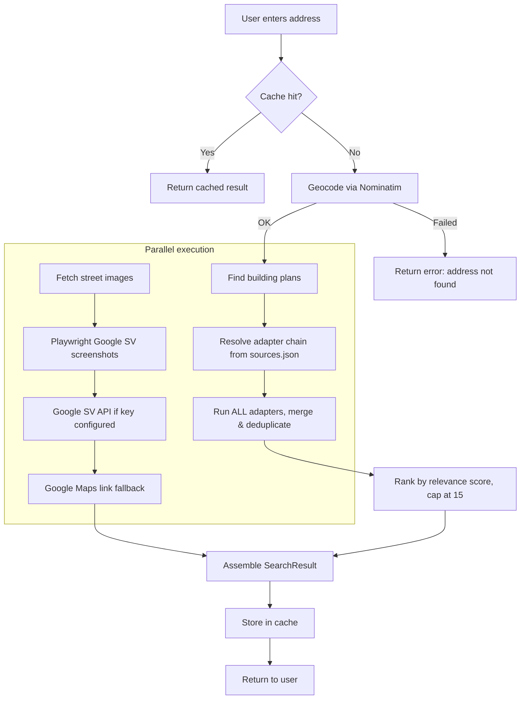
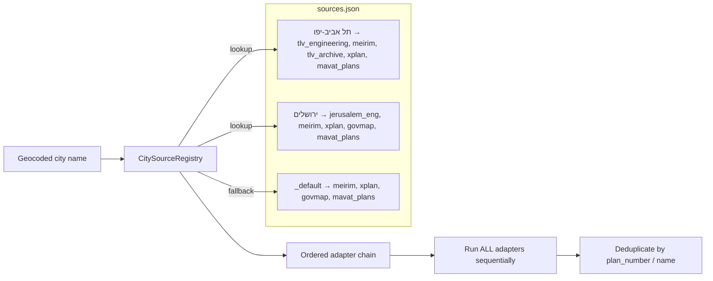
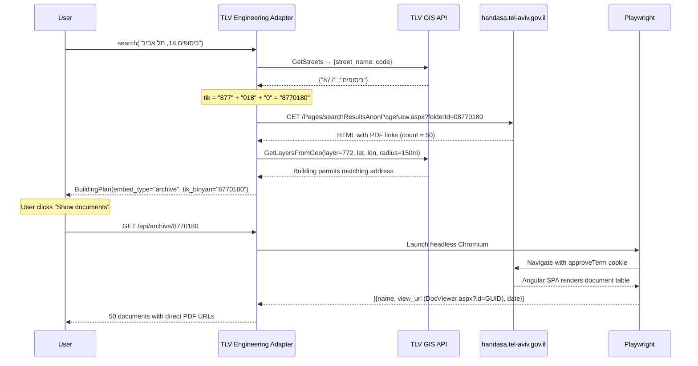
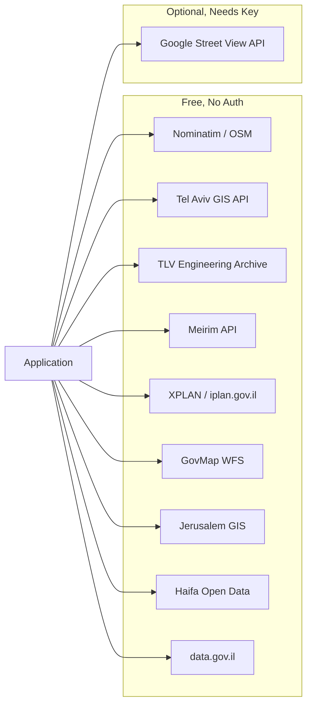

# Architecture

This document describes the system architecture of **Israel Building Plans Finder** — a service that retrieves building plans (היתרי בנייה, תב"ע) and street-level imagery for any Israeli address.

## High-Level Overview

```
┌─────────────┐    ┌─────────────┐
│   Web UI    │    │     CLI     │
│ (index.html)│    │  (cli.py)   │
└──────┬──────┘    └──────┬──────┘
       │                  │
       ▼                  ▼
┌─────────────────────────────────┐
│         FastAPI Server          │
│         (app/main.py)           │
├─────────────────────────────────┤
│      SearchOrchestrator         │
│      (app/orchestrator.py)      │
├────────┬────────────────────────┤
│        │                        │
│   ┌────▼─────┐  ┌─────────────┐│
│   │ Geocoder │  │   SQLite    ││
│   │(Nominatim│  │   Cache     ││
│   └────┬─────┘  └─────────────┘│
│        │                        │
│   ┌────▼────────────────┐      │
│   │ CitySourceRegistry  │      │
│   │  (sources.json)     │      │
│   └────┬────────────────┘      │
│        │ adapter chain          │
│   ┌────▼────────────────┐      │
│   │  Source Adapters     │      │
│   │ ┌──────────────────┐│      │
│   │ │ TLV Engineering  ││      │
│   │ │ TLV Archive      ││      │
│   │ │ Meirim           ││      │
│   │ │ XPLAN            ││      │
│   │ │ GovMap           ││      │
│   │ │ MAVAT            ││      │
│   │ │ Jerusalem Eng    ││      │
│   │ │ Haifa Data       ││      │
│   │ └──────────────────┘│      │
│   └─────────────────────┘      │
│                                 │
│   ┌─────────────────────┐      │
│   │  Street Imagery     │      │
│   │  (Playwright + GSV) │      │
│   └─────────────────────┘      │
└─────────────────────────────────┘
```

## Search Pipeline

Every search follows the same 5-step pipeline, whether triggered from the Web UI or the CLI.



### Step-by-step

| Step | What happens | Module |
|------|-------------|--------|
| 1. **Cache check** | Normalize the address, look up in SQLite. Return immediately on hit. | `db.py` |
| 2. **Geocode** | Call Nominatim with `countrycodes=il` and `accept-language=he`. Extract lat/lon, city, street, house number. | `geocoder.py` |
| 3. **Plans + Images** | Run in parallel via `asyncio.create_task`. Plans go through the adapter chain; images go through Playwright/Google SV. | `orchestrator.py` |
| 4. **Rank & cap** | Score each plan by address match, distance, area, status. Sort descending, return top 15. | `orchestrator.py` |
| 5. **Cache & return** | Store in SQLite, return `SearchResult`. | `orchestrator.py` |

## Adapter System

The adapter system is the core of the building plans search. It determines **which data sources** to query for a given city.

### How it works



1. **`sources.json`** maps city names to an ordered list of adapter IDs
2. **`CitySourceRegistry`** resolves the city name (with Unicode normalization for dashes/spaces), finds the matching entry, and instantiates the adapter chain
3. **All adapters run** sequentially — results are accumulated and deduplicated by plan number, TABA number, or name
4. If no city-specific entry exists, the `_default` chain runs (national-level sources)

### Adapter interface

Every adapter extends `SourceAdapter` and implements:

```python
class SourceAdapter(ABC):
    @property
    def name(self) -> str: ...         # Machine ID, matches sources.json
    @property
    def display_name(self) -> str: ... # Hebrew label for the UI badge
    async def search(self, address, lat, lon, *,
                     city, street, house_number) -> list[BuildingPlan]: ...
```

### Adapter catalog

| Adapter | ID | External API | What it returns |
|---------|-----|-------------|-----------------|
| **TLV Engineering** | `tlv_engineering` | Tel Aviv GIS + `handasa.tel-aviv.gov.il` | Exact address building files with PDF archive access, building permits (layer 772) |
| **TLV Archive** | `tlv_archive` | Tel Aviv GIS layers 527/528 | Zoning plans and parcels by spatial query |
| **Meirim** | `meirim` | `api.meirim.org` | Planning applications sorted by distance to the address |
| **XPLAN** | `xplan` | `ags.iplan.gov.il` ArcGIS | National planning database (all cities) |
| **GovMap** | `govmap` | `open.govmap.gov.il` WFS | Cadastral parcels (gush/helka) |
| **MAVAT Plans** | `mavat_plans` | GovMap WFS + XPLAN | Parcels mapped to XPLAN plans |
| **MAVAT** | `mavat` | `mavat.iplan.gov.il` | Fallback link to the national planning portal |
| **Jerusalem Eng** | `jerusalem_eng` | Jerusalem ArcGIS | TABA plans for Jerusalem |
| **Haifa Data** | `haifa_data` | Haifa open data CKAN | Zoning CSV data |

### City coverage

| Tier | Cities | Adapter chain |
|------|--------|--------------|
| **Enhanced** | Tel Aviv-Yafo | `tlv_engineering` → `meirim` → `tlv_archive` → `xplan` → `mavat_plans` |
| **Enhanced** | Jerusalem | `jerusalem_eng` → `meirim` → `xplan` → `govmap` → `mavat_plans` |
| **Enhanced** | Haifa | `meirim` → `haifa_data` → `xplan` → `govmap` → `mavat_plans` |
| **Standard** | 47 more cities (Petah Tikva, Rishon LeZion, Netanya, ...) | `meirim` → `xplan` → `govmap` → `mavat_plans` |
| **Fallback** | Any unlisted city | `_default`: `meirim` → `xplan` → `govmap` → `mavat_plans` |

## Tel Aviv Engineering Archive (Deep Dive)

The most advanced adapter. It provides **exact address** building documents — actual PDF construction permits, blueprints, and engineering files.



### How `tik_binyan` (building file ID) is constructed

```
Street code (from GIS) + House number (3 digits, zero-padded) + Entrance (0 = main)

Example: כיסופים 18
  Street code: 877
  House number: 018
  Entrance: 0
  tik_binyan: 8770180
```

### Why Playwright is needed

The Tel Aviv Engineering Archive (`handasa.tel-aviv.gov.il`) is an **AngularJS Single Page Application** backed by SharePoint. The document table is rendered dynamically by JavaScript — static HTTP requests only see an empty shell. Playwright:

1. Sets the `approveTerm=true` cookie (bypasses Terms of Service overlay)
2. Navigates to the archive page and waits for `networkidle`
3. Extracts document rows from the Angular-rendered table via `page.evaluate()`
4. Returns `DocViewer.aspx?id={GUID}` URLs — these serve **raw PDFs without authentication**

## Relevance Scoring

When multiple adapters return plans, results are ranked by a relevance score:

| Factor | Score | Why |
|--------|-------|-----|
| Has `tik_binyan` (building file ID) | +5 | Exact address match |
| Has PDF documents | +5 | Actionable result |
| Address match flag | +4 | Adapter confirmed street+house match |
| House number in plan name | +3 | Plan mentions the searched address |
| Street name in plan name | +2 | Plan is on the same street |
| Distance ≤ 50m | +4 | Very close proximity |
| Distance ≤ 100m | +3 | Close proximity |
| Distance ≤ 200m | +2 | Nearby |
| Area ≤ 5 dunam | +3 | Small, likely address-specific |
| Area ≤ 50 dunam | +2 | Neighborhood scale |
| Status "בתוקף" (active) | +1 | Plan is in effect |
| Fallback link | -10 | Penalize generic portal links |

Results are sorted by score (descending) and capped at 15.

## API Reference

### Core Search

#### `GET /api/search`

The main endpoint. Returns building plans and street images for an address.

| Parameter | Type | Required | Description |
|-----------|------|----------|-------------|
| `q` | string | Yes | Hebrew address (e.g., "כיסופים 18, תל אביב") |
| `plans_only` | bool | No | Only return building plans |
| `images_only` | bool | No | Only return street images |

**Response**: `SearchResult`
```json
{
  "address": "כיסופים 18, תל אביב",
  "geocode": {
    "lat": 32.11672,
    "lon": 34.83087,
    "city": "תל אביב-יפו",
    "street": "כיסופים",
    "house_number": "18",
    "display_name": "18, כיסופים, תל־אביב־יפו, ..."
  },
  "plans": [
    {
      "name": "תיק בניין – כיסופים 18",
      "plan_type": "תב\"ע",
      "status": "50 מסמכים בארכיון",
      "source": "ארכיון הנדסה ת\"א",
      "embed_type": "archive",
      "details": {
        "tik_binyan": "8770180",
        "pdf_count": 50
      }
    }
  ],
  "images": [...],
  "sources_tried": ["tlv_engineering", "meirim", "tlv_archive", "xplan", "mavat"],
  "from_cache": false
}
```

#### `GET /api/archive/{tik}`

Returns the list of PDF documents from a Tel Aviv engineering archive building file.

| Parameter | Type | Required | Description |
|-----------|------|----------|-------------|
| `tik` | path string | Yes | Building file ID (e.g., "8770180") |

**Response**:
```json
{
  "page_url": "https://handasa.tel-aviv.gov.il/Pages/searchResultsAnonPageNew.aspx?folderId=08770180",
  "tik": "08770180",
  "documents": [
    {
      "name": "תשריט שינוי פנימי בדירה מס 8",
      "view_url": "https://handasa.tel-aviv.gov.il/API/Pages/DocViewer.aspx?id=875CD560-BDAA-47BE-96DD-17EE7EB39C26",
      "download_url": "...",
      "date": "14/03/2019",
      "request_num": "20190430",
      "permit_num": "..."
    }
  ]
}
```

### Street Imagery

#### `GET /api/streetview/image`

Proxies Google Street View images (hides the API key from the frontend).

| Parameter | Type | Required | Description |
|-----------|------|----------|-------------|
| `lat` | float | Yes | Latitude |
| `lon` | float | Yes | Longitude |
| `heading` | int | No | Camera heading (0-360) |
| `size` | string | No | Image size (default "640x480") |

#### `GET /api/streetview/download`

Same as above but returns the image as a downloadable file attachment.

### Autocomplete

#### `GET /api/address/cities?q=...`

City name autocomplete from data.gov.il. Returns `[{code, name, name_en}]`.

#### `GET /api/address/streets?city_code=...&q=...`

Street name autocomplete for a specific city. Returns `[{code, name}]`.

### Management

| Endpoint | Method | Description |
|----------|--------|-------------|
| `/api/sources` | GET | Lists all registered cities and adapters |
| `/api/cache/stats` | GET | Returns cache entry counts by type |
| `/api/cache` | DELETE | Clears all cached data |
| `/docs` | GET | Swagger UI (auto-generated by FastAPI) |

## Caching Layer

SQLite with WAL mode for concurrent reads. Cache keys are normalized (lowercased, punctuation stripped, whitespace collapsed).

```
┌────────────────────────────────────────────┐
│              SQLite (cache.db)              │
├──────────┬──────────┬─────────┬────────────┤
│   key    │   kind   │  data   │ stored_at  │
├──────────┼──────────┼─────────┼────────────┤
│ "כיסופ…" │ "search" │ {JSON}  │ 1709500000 │
│ "כיסופ…" │ "geocode"│ {JSON}  │ 1709500000 │
└──────────┴──────────┴─────────┴────────────┘
```

- **TTL-based expiry**: each `kind` has its own TTL (configurable in `config.py`)
- **Lazy expiry**: expired entries are deleted on read, not by background job
- **Cache scope**: full `SearchResult` objects (plans + images + geocode)

## External Services

All APIs used are free and require no authentication (except optional Google Street View).



| Service | URL | Protocol | Used for |
|---------|-----|----------|----------|
| Nominatim | `nominatim.openstreetmap.org` | REST | Geocoding addresses to coordinates |
| Tel Aviv GIS | `gisn.tel-aviv.gov.il` | REST/SOAP | Street codes, spatial layer queries |
| TLV Engineering Archive | `handasa.tel-aviv.gov.il` | Web scraping (Playwright) | Building file PDFs |
| Meirim | `api.meirim.org` | REST | Planning applications by proximity |
| XPLAN | `ags.iplan.gov.il` | ArcGIS REST | National planning database |
| GovMap | `open.govmap.gov.il` | OGC WFS | Cadastral parcels (gush/helka) |
| Jerusalem GIS | `gisviewer.jerusalem.muni.il` | ArcGIS REST | Jerusalem TABA plans |
| Haifa Open Data | `opendata.haifa.muni.il` | CKAN CSV | Haifa zoning data |
| data.gov.il | `data.gov.il` | CKAN REST | City/street autocomplete |
| Google Street View | `maps.googleapis.com` | REST | Street-level imagery (optional) |

## Project Structure

```
AmitAddress/
├── cli.py                          # CLI entry point (Click + Rich)
├── sources.json                    # City → adapter chain mapping
├── requirements.txt                # Python dependencies
├── .env.example                    # API key template
│
├── app/
│   ├── main.py                     # FastAPI app, lifespan, static mounts
│   ├── config.py                   # Pydantic settings
│   ├── db.py                       # SQLite cache (WAL, TTL)
│   ├── orchestrator.py             # Search pipeline (cache → geocode → plans+images → rank)
│   │
│   ├── models/
│   │   └── schemas.py              # Pydantic: BuildingPlan, SearchResult, etc.
│   │
│   ├── routers/
│   │   ├── search.py               # /api/search, /api/archive, /api/streetview, etc.
│   │   └── address.py              # /api/address/cities, /api/address/streets
│   │
│   ├── services/
│   │   ├── geocoder.py             # Nominatim geocoding
│   │   ├── street_imagery.py       # Street images pipeline
│   │   ├── playwright_capture.py   # Headless Google SV screenshots
│   │   ├── address_data.py         # data.gov.il city/street autocomplete
│   │   ├── source_registry.py      # SourceAdapter base + CitySourceRegistry
│   │   ├── coord_utils.py          # WGS84 bounding box helper
│   │   │
│   │   └── adapters/               # Building plan data source adapters
│   │       ├── __init__.py          # Auto-imports all adapters
│   │       ├── tlv_engineering.py   # Tel Aviv engineering archive + permits
│   │       ├── tlv_archive.py       # Tel Aviv GIS plans
│   │       ├── meirim.py            # Meirim proximity API
│   │       ├── xplan.py             # XPLAN national plans
│   │       ├── mavat.py             # MAVAT fallback link
│   │       ├── mavat_plans.py       # GovMap parcels + XPLAN plans
│   │       ├── govmap.py            # GovMap WFS cadastral
│   │       ├── jerusalem_eng.py     # Jerusalem ArcGIS
│   │       └── haifa_data.py        # Haifa open data
│   │
│   ├── static/                      # Web UI
│   │   ├── index.html               # Main page (Hebrew RTL)
│   │   ├── app.js                   # Search, rendering, archive viewer
│   │   └── style.css                # Styles, cards, lightbox
│   │
│   └── captures/                    # Street View screenshots (runtime)
│
└── docs/
    └── screenshots/                 # Documentation screenshots
```

## Adding a New City Adapter

1. Create `app/services/adapters/my_city.py`:

```python
from app.services.source_registry import SourceAdapter, register_adapter
from app.models.schemas import BuildingPlan

@register_adapter
class MyCityAdapter(SourceAdapter):
    @property
    def name(self) -> str:
        return "my_city"

    @property
    def display_name(self) -> str:
        return "עיריית XYZ"

    async def search(self, address, lat, lon, *,
                     city="", street="", house_number="") -> list[BuildingPlan]:
        # Query your city's GIS/API here
        return [...]
```

2. Import it in `app/services/adapters/__init__.py`

3. Add the city to `sources.json`:
```json
"עיר חדשה": {
    "sources": ["my_city", "meirim", "xplan", "mavat_plans"],
    "notes": "Custom adapter first, national fallbacks after"
}
```

## Design Decisions

### Why accumulate all adapter results instead of stopping at first success?

Different adapters return different types of data. The engineering archive returns exact-address PDFs, Meirim returns nearby planning applications, and XPLAN returns zoning plans. A complete picture requires all of them. Deduplication by plan number prevents duplicates.

### Why Playwright for the Tel Aviv archive?

The archive is an AngularJS SPA backed by SharePoint. Static HTTP requests return only the JavaScript shell — no document data. Playwright renders the page fully, extracts GUID-based `DocViewer.aspx` URLs that serve raw PDFs without authentication. An httpx fallback exists for environments without Playwright.

### Why SQLite for caching instead of Redis?

This is a single-server POC. SQLite with WAL mode handles concurrent reads efficiently, requires zero infrastructure, and the cache file is portable. A Redis/Valkey upgrade is trivial if needed.

### Why relevance scoring instead of just returning all plans?

A coordinate query against national planning databases can return dozens of overlapping area plans. Relevance scoring prioritizes exact-address results (building files, permits) over broad zoning plans, keeping the result list actionable.
