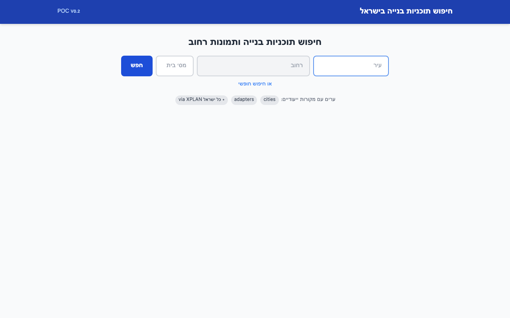
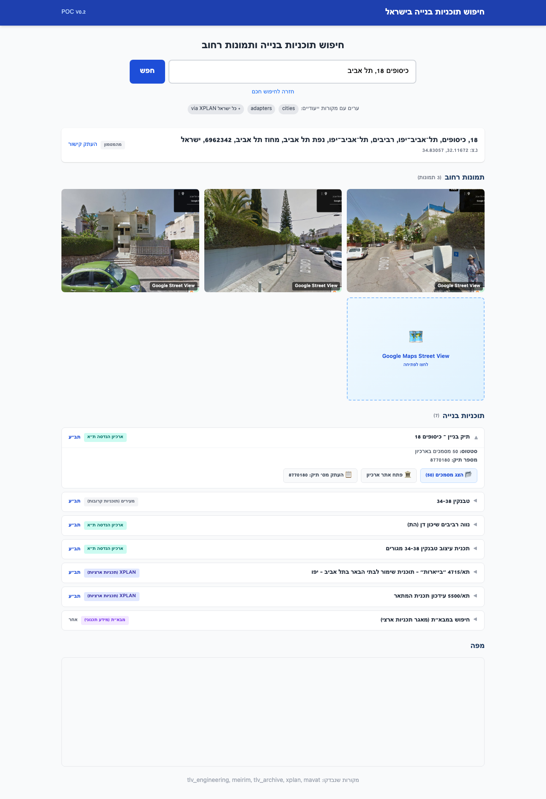
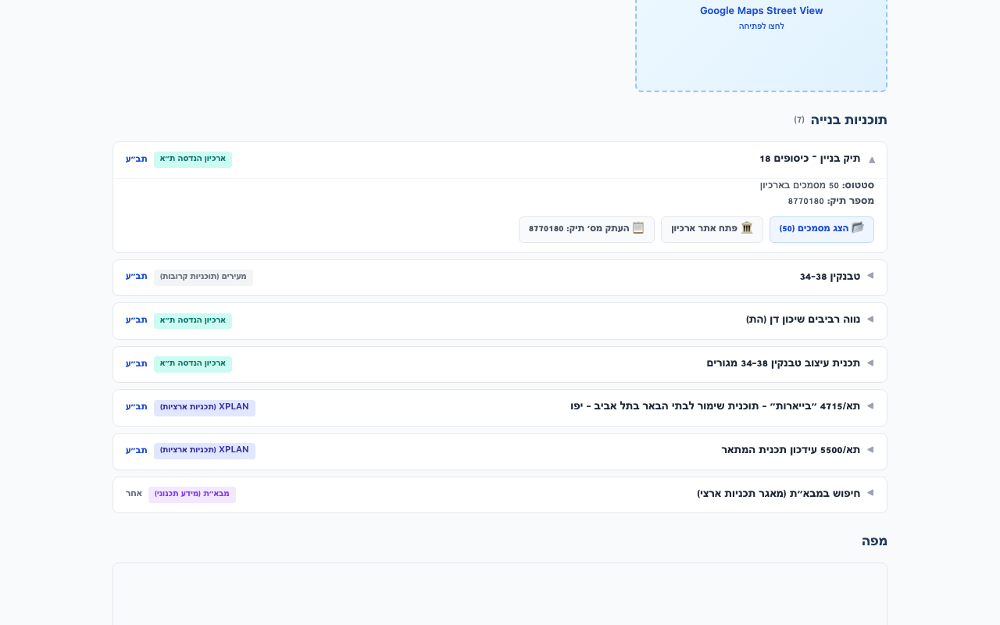

# Israel Building Plans Finder

Search for building plans (היתרי בנייה, תב"ע), construction permits, and street-level images by Israeli address. Supports 50+ cities with enhanced data for Tel Aviv, Jerusalem, and Haifa.



## Features

- **Exact address building documents** — Tel Aviv engineering archive with 5.3M+ PDFs accessible via direct `DocViewer` links
- **Building permits** — construction permits (layer 772) filtered to the exact address
- **National coverage** — XPLAN, Meirim, GovMap, and MAVAT adapters cover all Israeli cities
- **Street-level imagery** — Google Street View screenshots via Playwright (no API key needed for basic capture)
- **Smart address form** — city/street autocomplete from data.gov.il, plus free-text search
- **Relevance ranking** — results scored by address match, distance, area, and plan status
- **Dual interface** — Hebrew RTL Web UI + CLI with Rich tables
- **SQLite cache** — TTL-based, zero-config caching
- **All free APIs** — no paid services required (Google SV key optional for high-res images)

## Screenshots

### Search Results

Full search results for "כיסופים 18, תל אביב" showing street images, building file with 50 archive documents, nearby planning applications, and zoning plans:



### Building Plans

Detailed view of building plans — the engineering archive entry (with direct PDF access), Meirim proximity plans, TLV archive plans, and XPLAN national plans:



## Quick Start

```bash
python3 -m venv .venv
source .venv/bin/activate
pip install -r requirements.txt

# Install Playwright browsers (needed for archive PDF scraping and street images)
playwright install chromium

# (Optional) Configure API keys
cp .env.example .env

# Start the server
uvicorn app.main:app --reload
# Open http://localhost:8000
```

## CLI Usage

```bash
# Full search (plans + images)
python cli.py search "דיזנגוף 50, תל אביב"

# Plans only
python cli.py search "בן יהודה 10, ירושלים" --plans-only

# Images only
python cli.py search "הרצל 1, חיפה" --images-only

# List registered city sources
python cli.py sources

# Cache management
python cli.py cache stats
python cli.py cache clear
```

## API Endpoints

| Endpoint | Method | Description |
|----------|--------|-------------|
| `/api/search?q=...` | GET | Search by address — returns plans + images |
| `/api/archive/{tik}` | GET | List PDF documents from TLV engineering archive |
| `/api/streetview/image?lat=&lon=` | GET | Proxy Google Street View image |
| `/api/streetview/download?lat=&lon=` | GET | Download Street View image as file |
| `/api/address/cities?q=...` | GET | City name autocomplete |
| `/api/address/streets?city_code=&q=` | GET | Street name autocomplete |
| `/api/sources` | GET | List registered city sources and adapters |
| `/api/cache/stats` | GET | Cache statistics |
| `/api/cache` | DELETE | Clear cache |
| `/docs` | GET | Interactive Swagger API docs |

## City Coverage

| Tier | Cities | Data Sources |
|------|--------|-------------|
| **Enhanced** | Tel Aviv-Yafo | Engineering archive (PDFs), building permits, Meirim, TLV GIS, XPLAN |
| **Enhanced** | Jerusalem | Jerusalem GIS plans, Meirim, XPLAN, GovMap, MAVAT |
| **Enhanced** | Haifa | Meirim, Haifa open data (zoning), XPLAN, GovMap, MAVAT |
| **Standard** | 47 more cities | Meirim, XPLAN, GovMap, MAVAT |
| **Fallback** | Any unlisted city | National sources (Meirim, XPLAN, GovMap, MAVAT) |

## Data Sources

| Source | Coverage | API Type | Auth | What it provides |
|--------|----------|----------|------|-----------------|
| Tel Aviv GIS | Tel Aviv | REST | Free | Street codes, spatial queries, building permits |
| TLV Engineering Archive | Tel Aviv | Playwright scrape | Free | PDF construction documents (5.3M+) |
| Meirim | All Israel | REST | Free | Planning applications by proximity |
| XPLAN | All Israel | ArcGIS REST | Free | National planning database |
| GovMap | All Israel | OGC WFS | Free | Cadastral parcels (gush/helka) |
| MAVAT | All Israel | Web link | Free | National planning portal |
| Jerusalem GIS | Jerusalem | ArcGIS REST | Free | TABA plans |
| Haifa Open Data | Haifa | CKAN CSV | Free | Zoning information |
| Nominatim | Global | REST | Free | Address geocoding |
| data.gov.il | Israel | CKAN REST | Free | City/street autocomplete |
| Google Street View | Global | REST | Optional key | High-res street imagery |

## Architecture

See [ARCHITECTURE.md](ARCHITECTURE.md) for detailed system architecture, data flows, adapter design, relevance scoring, and API reference with Mermaid diagrams.

## Adding a New City

1. Add an entry to `sources.json`:
   ```json
   "עיר חדשה": {
     "sources": ["my_city_adapter", "meirim", "xplan", "mavat_plans"],
     "notes": "Custom adapter first, national fallbacks after"
   }
   ```

2. Create an adapter in `app/services/adapters/my_city.py`:
   ```python
   from app.services.source_registry import SourceAdapter, register_adapter
   from app.models.schemas import BuildingPlan

   @register_adapter
   class MyCityAdapter(SourceAdapter):
       @property
       def name(self) -> str:
           return "my_city_adapter"

       @property
       def display_name(self) -> str:
           return "עיריית XYZ"

       async def search(self, address, lat, lon, *,
                        city="", street="", house_number="") -> list[BuildingPlan]:
           # Query your city's GIS/API here
           return [...]
   ```

3. Import it in `app/services/adapters/__init__.py`

## Project Structure

```
├── cli.py                        # CLI entry point (Click + Rich)
├── sources.json                  # City → adapter chain config (50 cities)
├── requirements.txt
├── ARCHITECTURE.md               # Detailed system architecture
├── app/
│   ├── main.py                   # FastAPI app, lifespan, routers
│   ├── config.py                 # Settings (API keys, cache TTL, paths)
│   ├── db.py                     # SQLite cache with WAL + TTL
│   ├── orchestrator.py           # Search pipeline + relevance scoring
│   ├── models/
│   │   └── schemas.py            # Pydantic: BuildingPlan, SearchResult, etc.
│   ├── routers/
│   │   ├── search.py             # /api/search, /api/archive, /api/streetview
│   │   └── address.py            # /api/address/cities, /api/address/streets
│   ├── services/
│   │   ├── geocoder.py           # Nominatim geocoding
│   │   ├── street_imagery.py     # Street images (Playwright + Google SV)
│   │   ├── source_registry.py    # Adapter base class + CitySourceRegistry
│   │   └── adapters/             # 9 building plan adapters
│   │       ├── tlv_engineering.py # Tel Aviv engineering archive + permits
│   │       ├── tlv_archive.py    # Tel Aviv GIS zoning plans
│   │       ├── meirim.py         # Meirim proximity API
│   │       ├── xplan.py          # XPLAN national plans
│   │       ├── govmap.py         # GovMap WFS cadastral
│   │       ├── mavat.py          # MAVAT fallback
│   │       ├── mavat_plans.py    # Parcels → XPLAN plans
│   │       ├── jerusalem_eng.py  # Jerusalem ArcGIS
│   │       └── haifa_data.py     # Haifa open data
│   └── static/                   # Web UI (Hebrew RTL)
│       ├── index.html
│       ├── app.js
│       └── style.css
└── docs/
    └── screenshots/
```

## License

POC — for educational and research purposes.
